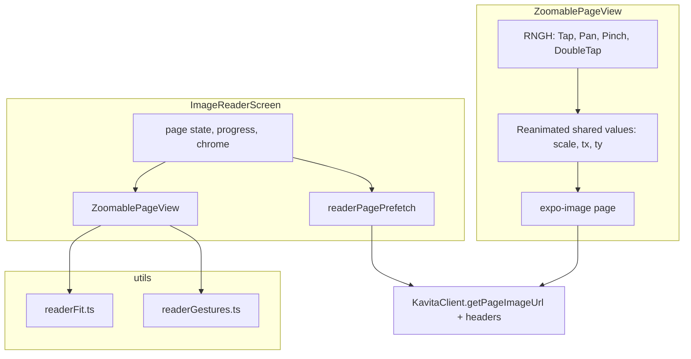

# Plan: Image Reader Zoom, Fit & Gestures

## Current state

| Area | Today | Problem |
|------|-------|---------|
| Layout | `SCREEN_WIDTH` / `SCREEN_HEIGHT` at module load | Breaks on rotation |
| Image | `fetch` → blob → `FileReader` base64 → `RNImage` | High JS memory; no native decode cache |
| Gestures | `TouchableOpacity` tap zones when chrome hidden | No zoom, pan, pinch; center tap toggles chrome only |
| Page turn | Immediate on R/L **20%** tap (fit and zoomed) | Edge-then-next when panned to edge (deferred Q8) |
| Zoom persistence | N/A | N/A |
| EPUB | `EpubReaderScreen` ScrollView | Separate; unchanged by default |
| Prefetch | `cacheChapter` on series detail only | Reader loads one page at a time |

**Dependencies already in repo**: `expo-image`, `react-native-gesture-handler`, `react-native-reanimated` (used elsewhere; reader not wired).

## Design references

- **Contextual navigation**: zoomed → pan within page; at fit → tap edges turn ([cacoveanu](https://blog.cacoveanu.com/2020/2020.07.31.gesture_navigation_in_comic_books.html)).
- **CDisplayEx**: fit width/height/screen, double-tap zoom, pinch, scroll-to-edge before page change.
- **Convention**: double-tap to zoom is widely expected on mobile comic readers.

## Architecture



### Memory-safe image pipeline

1. **Stop storing base64 in React state.** Use `getPageImageUrl(chapterId, page)` + `Authorization: Bearer` header on `expo-image`.
2. **Stable recycling**: `key={page}` and `recyclingKey={`${chapterId}-${page}`}` so native layer can reuse textures.
3. **Prefetch without state duplication**: prefetch service calls `Image.prefetch(url, { headers })` or mounts off-screen `expo-image` with `priority="low"` — cap concurrent warms at 2.
4. **Revoke on exit**: cancel in-flight prefetch `AbortController` on unmount; clear warm queue when leaving reader.
5. **PDF chapters (Q6 A+C):** `extractPdf=true` on image requests **PDF only**. On open, `GET chapter-info?extractPdf=true&includeDimensions=true` for PDF to warm cache and return `pageDimensions`. CBZ/archive: omit `extractPdf`.

### ZoomablePageView (custom RNGH + Reanimated)

**Double-tap zoom targets (Q4):**

- **Portrait**: toggle between fit (fitScreen) and **2× fitScale**
- **Landscape**: toggle between fit (fitWidth default) and **fitWidth scale**; when already at fitWidth, zoom-in uses **2× fitWidth** to avoid no-op

**Pinch max:** 4× fitScale (Q5).

**Shared values**: `scale`, `translateX`, `translateY`, `fitScale` (derived on layout + orientation).

**Gestures** (composed with `Gesture.Race` / `Gesture.Simultaneous` as needed):

| Gesture | When | Action |
|---------|------|--------|
| Double-tap | always | Toggle fit ↔ zoom target (Q1); target by orientation (Q4) |
| Pinch | always | Update scale between `fitScale` and `maxScale` |
| Pan | scale &gt; fitScale | Update translation with clamp |
| Single tap | scale == fitScale, chrome hidden | Zone test → page turn or chrome |
| Single tap | scale &gt; fitScale, at edge | Page turn |

**Bounds math** (`readerFit.ts`):

```
displayedW = imageW * fitScale * scale
displayedH = imageH * fitScale * scale
maxTx = max(0, (displayedW - viewportW) / 2)
// clamp translateX to [-maxTx, maxTx], same for Y
```

On orientation change: recompute `fitScale`, adjust `scale` relative to fit if at fit, else preserve user scale ratio.

### Gesture vs tap disambiguation

- Pan gesture `activeOffset` / `failOffset` so small movement does not steal taps.
- Track `isPanActive` shared value; tap handler no-ops while true.
- Reuse **20%** L/R zones when chrome hidden; center double-tap zoom on pan path via viewport-fixed gestures.

### Edge-then-next-page

`readerGestures.ts`:

```ts
canTurnPage(direction, scale, translateX, translateY, bounds) → boolean
```

- If at fit: always allow (current behavior).
- If zoomed: allow only when translation at corresponding edge (±ε px).

### Settings store

Extend reading preferences (new `readerSettingsStore` or `themeStore` slice):

| Key | Default | Settings UI |
|-----|---------|-------------|
| `fitMode` | `auto` (portrait screen / landscape width) | Fit screen / width / height / auto |
| `prefetchPages` | `2` | 0 / 2 / 5 (optional) |
| `cacheEntireAlbum` | `false` | Switch |
| `maxZoom` | `4` | Advanced (optional Phase 4) |
| `epubGesturesEnabled` | `false` | Global off + per-series override Phase 5 |

Persist via Zustand + AsyncStorage; mirror all keys in `SettingsScreen`.

### EPUB toggle (Phase 5 — contract only)

- Storage shape: `epubGestureOverrides: Record<seriesId, boolean>` + global `epubGesturesDefault: false`.
- `ReaderScreen` / series detail: no routing change until implementation feature.
- Document in contract; do not modify `EpubReaderScreen` behavior in Phases 1–4.

## Phased delivery

### Phase 1 — Foundation (P1)

**Goal**: Rotation-safe layout + memory-safe images; no zoom yet.

- `useWindowDimensions` in `ImageReaderScreen`
- `getPageImageAuthSource(chapterId, page)` helper on client
- Replace `RNImage` + base64 with `expo-image`
- `readerFit.ts` with fit-screen / fit-width / fit-height + auto default
- Apply auto fit (landscape → width) in static view before zoom component lands
- Unit tests: fit scale for sample aspect ratios

**Exit**: Landscape fills width; no base64 in state; rotation works.

---

### Phase 2 — Zoom & pan core (P1)

**Goal**: Double-tap, pinch, 2D pan with bounds.

- `ZoomablePageView` component
- Wire into `ImageReaderScreen` (replace static image container)
- Double-tap toggle (**Q1** assumption)
- Pinch with min/max scale
- Pan clamped to page edges
- Grayscale overlay atop zoomable view (`pointerEvents="none"`)

**Exit**: User can zoom and pan any page; center tap still toggles chrome at fit.

---

### Phase 3 — Contextual navigation (P1)

**Goal**: Correct page-turn semantics + zoom persistence.

- `readerGestures.ts` edge detection
- Suppress tap-turn while panning
- Edge-then-next-page when zoomed
- Persist `scale` across `setCurrentPage`; reset pan on page change (**Q2** assumption)
- Preserve progress save, sounds, hardware back, chrome zones

**Exit**: No accidental page turns when exploring zoomed panel; zoom survives page turns.

---

### Phase 4 — Settings, prefetch & polish (P2–P3)

**Goal**: Power settings + performance + minor recommendations.

- Settings: fit mode override, prefetch depth, cache entire album
- `readerPagePrefetch.ts` integrated on page change (promote [backlog](../backlog/reader-page-prefetch.md))
- Concurrency cap; cancel on unmount
- Reduce-motion shorter animations
- Loading placeholder per page; retry on `expo-image` error
- Integration test or harness for prefetch window
- Manual QA checklist (rotation, large CBZ, PDF extract, grayscale)

**Exit**: Settings parity; snappy forward page turns on slow network when prefetch hits.

---

### Phase 5 — EPUB toggle shell (P4)

**Goal**: Data model + Settings + contract for future EPUB gestures; **no EPUB behavior change**.

- Schema for global + per-series EPUB gesture opt-in (**Q3**)
- Settings UI (disabled helper text: "Coming soon" or hidden behind dev flag — product choice)
- `ReaderScreen` reads flag but gates with `false` implementation stub
- Spec note for follow-up `012-epub-gesture-reader` if needed

**Exit**: Toggle can be stored and queried; EPUB reader unchanged.

---

### Phase 6 — Deferred / roadmap (document only)

Not implemented in `011`; track separately:

| Item | Notes |
|------|-------|
| Double-page spread | Tablets/landscape; needs spread detection |
| EPUB gesture implementation | After toggle semantics settled |
| `cacheChapter` unification | **Q10** — align series-detail background cache with reader prefetch |
| Pinch zoom sensitivity tuning | Minor; user testing |
| Haptic on page edge | Minor polish |
| Tablet split-screen | Out of scope |

## Risks & mitigations

| Risk | Mitigation |
|------|------------|
| `expo-image` auth headers not cached same as base64 | Verify `Image.prefetch` with headers; fallback to disk cache via client |
| Gesture conflict with `TouchableOpacity` chrome | Single `GestureDetector` root; remove overlapping touchables on image area |
| Large webtoon pages OOM | Fit-width + max texture size; consider downsample request if Kavita supports |
| Reanimated + Paper overlay z-index | Keep chrome in SafeAreaViews above gesture layer |
| PDF `extractPdf` slow | Prefetch + loading indicator; do not block gestures |

## Validation

See [quickstart.md](./quickstart.md). Phase gates:

1. **Phase 1**: Rotate device mid-read — layout correct; heap stable over 10 pages.
2. **Phase 2**: Pinch + double-tap on physical device (not only emulator).
3. **Phase 3**: Zoomed pan to right edge → tap advances; zoomed center tap does not.
4. **Phase 4**: Settings change fit mode → new session reflects; airplane mode after prefetch → instant next page.
5. **Phase 5**: EPUB opens as before; toggle persists without effect.

## API note

No Kavita API changes. `GET /api/Reader/image?chapterId=&page=` with Bearer token (and optional `apiKey` query) unchanged. Client already exposes `getPageImageUrl`.
